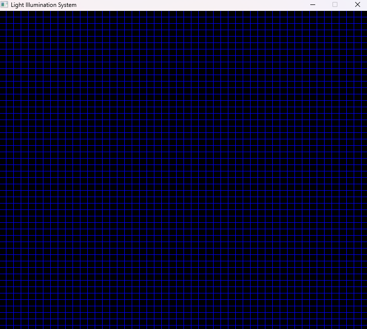
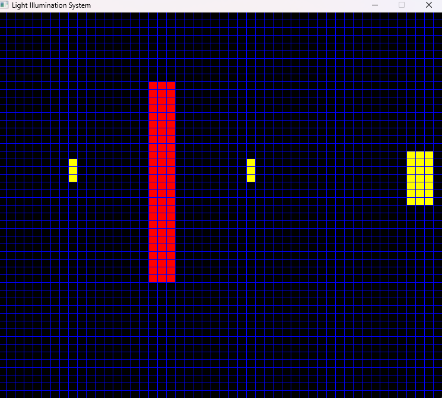
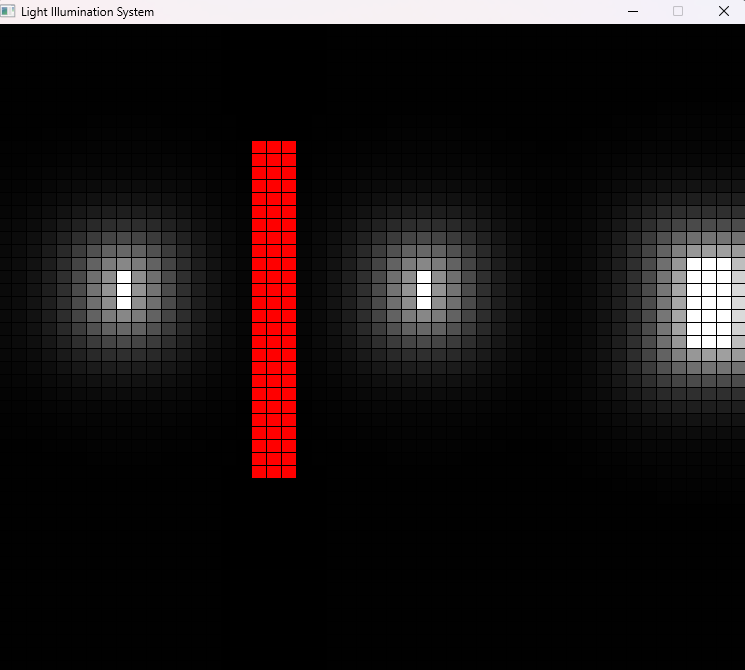

# 💡 LightSim

> An interactive 2D light simulation.
> Place walls and light sources



---

## About

LightSim is an interactive sandbox where you place walls and point lights on a 2D space, then simulate how light appears and get blocked. Built with SDL2

---

## Features

- 🔦 Place unlimited point light sources
- 🧱 Draw walls with click-and-drag

---

## Screenshots

| Empty Scene | With Walls & Lights | Simulated |
|-------------|---------------------|---------------------|
|  |  |  |

---

## Tech Stack
C++

SDL2

---

## Getting Started

### Prerequisites

- SDL2 installed on your system
- C++ Compiler

### Build

```bash
git clone https://github.com/KingOws/LightSimulator.git
cd lightsim
g++ LightIlluminationSystem.cpp -o light_sim -I"SDL2/include/SDL2" -L"SDL2/lib" -lmingw32 -lSDL2main -lSDL2 -mwindows
./light_sim.exe
```

---

## Controls

| Input | Action |
|-------|--------|
| `Right Click` | Place a light source |
| `Left click + drag` | Draw a wall |
| `Space` | Run the Simulation |

---


## Potential Future Additions

- [ ] Raycasts
- [ ] Adjustable light colors
- [ ] Save/load scenes
- [ ] Coloured light blending
